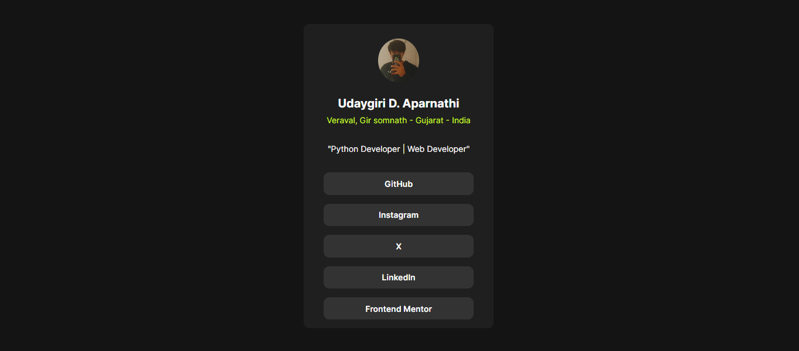

# Social Links Profile - Udaygiri

This is a solution to the [Social links profile challenge on Frontend Mentor](https://www.frontendmentor.io/challenges/social-links-profile-UG32l9m6dQ). Frontend Mentor challenges help you improve your coding skills by building realistic projects.

## Table of contents

- [Overview](#overview)
  - [The challenge](#the-challenge)
  - [Screenshot](#screenshot)
  - [Links](#links)
- [My process](#my-process)
  - [Built with](#built-with)
  - [What I learned](#what-i-learned)
  - [Continued development](#continued-development)
  - [Useful resources](#useful-resources)
- [Author](#author)
- [Acknowledgments](#acknowledgments)

## Overview

### The challenge

Users should be able to see hover and focus states for all interactive elements on the page.

### Screenshot



### Links

- Solution URL: (https://github.com/udaygiri/Social-Links-Profile-)
- Live Site URL: (https://socialprofileudaygiri.vercel.app/)

## My process

### Built with

- Semantic HTML5 markup
- CSS custom properties
- Flexbox
- CSS Grid
- Mobile-first workflow

### What I learned

During this project, I learned how to structure a social links profile using HTML and style it with CSS. Here are some snippets of code I'm proud of:

```html
<div class="name">
  Udaygiri D. Aparnathi
</div>
```
```css
.link a {
  display: flex;
  width: 15rem; /* Adjust the width as needed */
  height: 1.4rem; /* Adjust the height as needed */
  padding: .5rem;
  border-radius: 10px;
  align-items: center;
  justify-content: center;
  background-color: var(--grey);
  text-decoration: none;
  font-size: 14px;
  font-family: var(--fontf);
  font-weight: 600;
  color: var(--white);
}
```

### Continued development

In future projects, I aim to continue improving my skills in responsive design and CSS techniques.

### Useful resources

- [MDN Web Docs](https://developer.mozilla.org/en-US/docs/Web) - A comprehensive resource for HTML, CSS, and JavaScript.
- [Frontend Mentor](https://www.frontendmentor.io/) - A great platform for practicing frontend development by building real projects.

## Author

- Frontend Mentor - [@udaygiri](https://www.frontendmentor.io/profile/udaygiri)
- Twitter - [@udaygiri](https://www.twitter.com/udaygiri)

## Acknowledgments

I would like to thank Frontend Mentor for providing this challenge and the supportive community for feedback and guidance.
